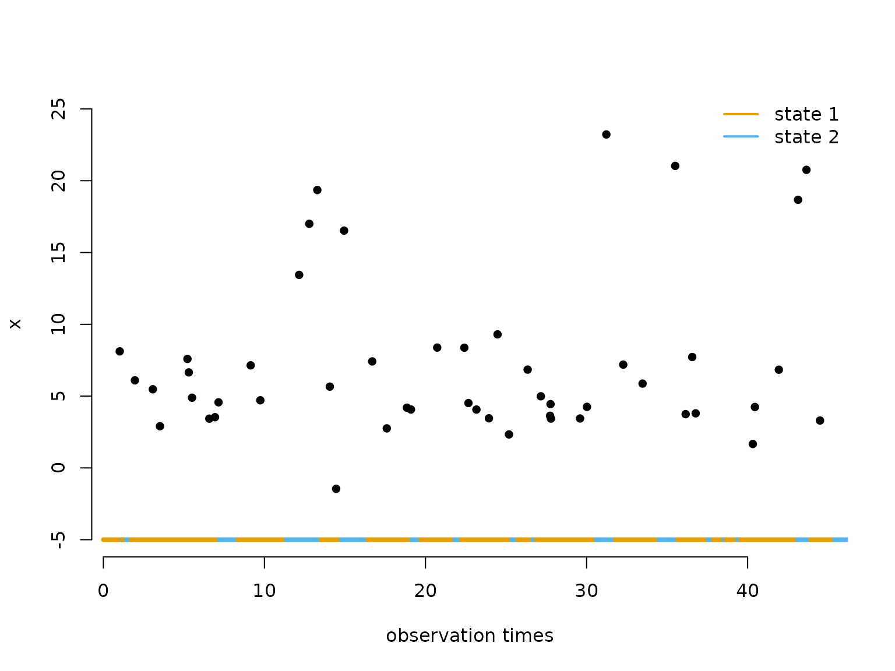
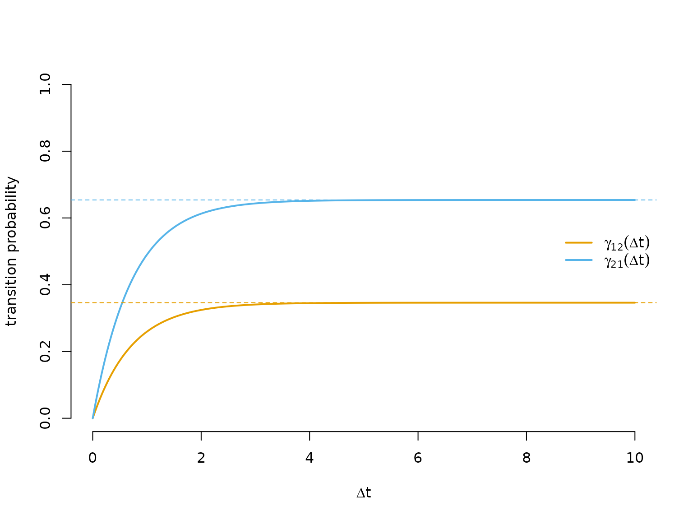
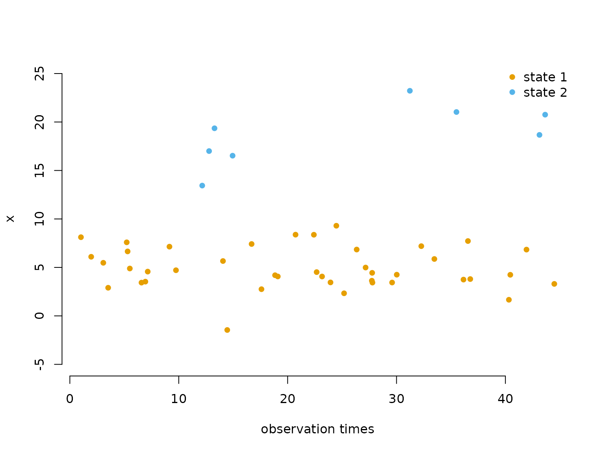
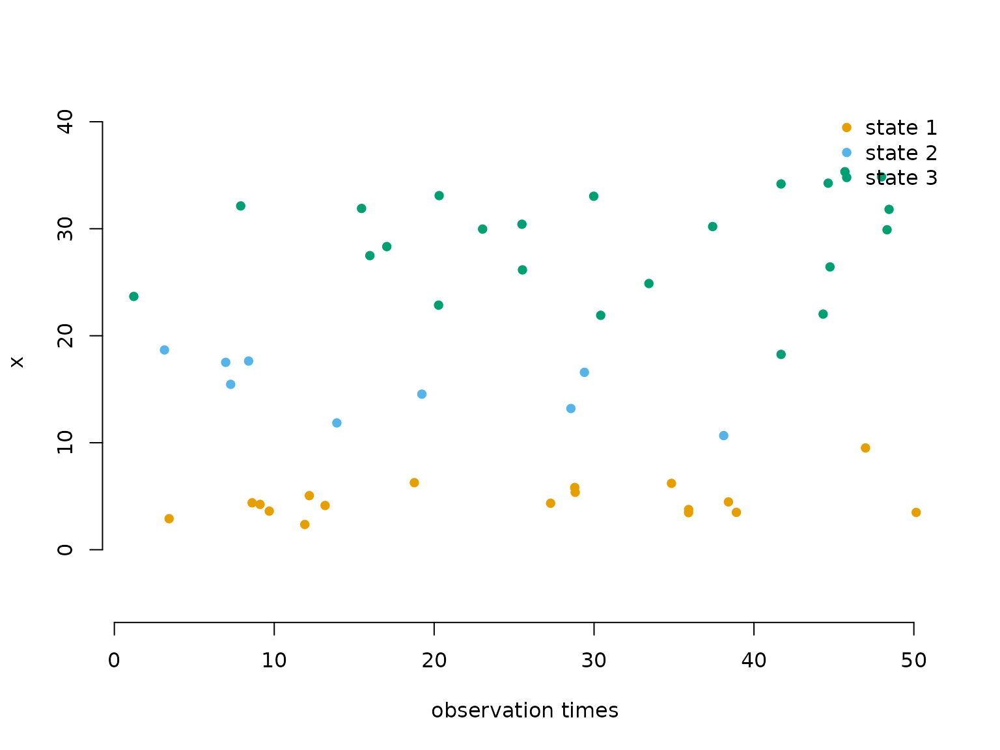

# 6 Continuous-time HMMs

> Before diving into this vignette, we recommend reading the vignettes
> [**Introduction to
> LaMa**](https://janolefi.github.io/LaMa/articles/Intro_to_LaMa.html)
> and [**Automatic differentiation via
> RTMB**](https://janolefi.github.io/LaMa/articles/LaMa_and_RTMB.html).

``` r

library(LaMa)
#> Loading required package: RTMB
```

In standard HMMs, observations are assumed to arrive at **regular,
equidistant time points**, so that the transition probability matrix
\Gamma can be given a consistent interpretation with respect to a fixed
time unit (e.g. one hour or one day). In many real-world applications
this assumption breaks down: animal telemetry fixes arrive at varying
intervals, patient measurements are taken at unequal times, or data
simply have gaps. Using a regular HMM in such cases leads to a
misspecified transition structure, because the same \Gamma is applied
regardless of whether the time gap is short or long.

The natural remedy is a **continuous-time HMM**, which replaces the
discrete-time Markov chain with a **continuous-time Markov chain
(CTMC)**. The observation model and likelihood structure remain the
same; only the state process changes. One important prerequisite is the
**snapshot property**: the observed value at time t may only depend on
the state *at that instant*, not on the history of the process or on how
much time has elapsed since the previous observation. This is a
reasonable assumption for many biological and physical processes. For
more details see Glennie et al. ([2023](#ref-glennie2023hidden)).

## The generator matrix

A CTMC is fully characterised by its **(infinitesimal) generator
matrix** Q = \begin{pmatrix} q\_{11} & q\_{12} & \cdots & q\_{1N} \\
q\_{21} & q\_{22} & \cdots & q\_{2N} \\ \vdots & \vdots & \ddots &
\vdots \\ q\_{N1} & q\_{N2} & \cdots & q\_{NN} \\ \end{pmatrix}, where
q\_{ij} \geq 0 for i \neq j and the diagonal satisfies q\_{ii} =
-\sum\_{j \neq i} q\_{ij}, so that every row sums to zero.

The off-diagonal entry q\_{ij} is the **instantaneous rate** at which
the process transitions from state i to state j. The diagonal entry
-q\_{ii} = \sum\_{j \neq i} q\_{ij} is the total leaving rate from state
i, and the **dwell time** (time spent in state i before leaving) is
exponentially distributed with mean 1/(-q\_{ii}). Conditional on leaving
state i, the probability of moving to state j \neq i is \omega\_{ij} =
\frac{q\_{ij}}{-q\_{ii}}. These two properties — the dwell time
distribution and the conditional next-state probabilities — together
fully describe the dynamics of the chain, and they are also how we
simulate it in the examples below.

## From the generator to transition probabilities

Given Q and a time interval of length \Delta t, the transition
probability matrix is obtained via the **matrix exponential**:
\Gamma(\Delta t) = \exp(Q \\ \Delta t). This follows from the Kolmogorov
forward equations; see Dobrow ([2016](#ref-dobrow2016introduction)) for
details. The key practical point is that \Gamma(\Delta t) automatically
adapts to the length of the interval: short gaps produce a matrix close
to the identity (little chance of switching), and long gaps produce a
matrix close to the stationary distribution (the process has had time to
mix). `LaMa` computes this efficiently for an entire vector of time
differences using
[`tpm_ct()`](https://janolefi.github.io/LaMa/reference/tpm_ct.md).

## Likelihood

The likelihood of a continuous-time HMM for observations x\_{t_1},
\dots, x\_{t_T} at irregular times t_1 \< \dots \< t_T has **exactly the
same structure** as the regular HMM likelihood: L(\theta) = \delta^{(1)}
\\\Gamma(\Delta t_1)\\ P(x\_{t_2})\\ \Gamma(\Delta t_2)\\ P(x\_{t_3})
\cdots \Gamma(\Delta t\_{T-1})\\ P(x\_{t_T})\\ \mathbf{1}^\top, where
\Delta t_k = t\_{k+1} - t_k and each \Gamma(\Delta t_k) = \exp(Q
\\\Delta t_k) is specific to its interval. The initial distribution
\delta^{(1)} is typically set to the stationary distribution of the
CTMC, available via
[`stationary_ct()`](https://janolefi.github.io/LaMa/reference/stationary_ct.md).
Everything else — the allprobs matrix and the forward algorithm via
[`forward()`](https://janolefi.github.io/LaMa/reference/forward.md) — is
identical to the regular HMM case.

## Example 1: two states

### Simulating data

We start by setting parameters. The generator below specifies that from
state 1 the leaving rate is 0.5 (mean dwell time 1/0.5 = 2 time units),
and from state 2 the leaving rate is 1 (mean dwell time 1/1 = 1 time
unit), so state 1 is the more persistent state.

``` r

# generator matrix Q
Q = matrix(c(-0.5, 0.5,
              1.0, -1.0), nrow = 2, byrow = TRUE)

# state-dependent (normal) distribution parameters
mu = c(5, 20)
sigma = c(2, 5)
```

We simulate the CTMC by drawing exponentially distributed dwell times,
then switching state. Within each sojourn we generate observation times
as a Poisson process with rate \lambda = 1 — this represents an
irregular but otherwise uninformative observation mechanism that is
**not part of the model**.

``` r

set.seed(123)

k = 200              # number of state switches to simulate
s = rep(NA, k)       # latent state sequence
trans_times = rep(NA, k) # cumulative times at which state switches occur

# initialise: draw first state and its dwell time
s[1] = sample(1:2, 1)
dwell = rexp(1, -Q[s[1], s[1]])  # dwell time ~ Exp(-q_ii)
trans_times[1] = dwell

# Poisson arrivals during first sojourn [0, dwell], uniform within
new_obs = sort(runif(rpois(1, dwell), 0, dwell))
obs_times = new_obs
x = rnorm(length(new_obs), mu[s[1]], sigma[s[1]])

for(t in 2:k){
  # for 2 states, the only possible next state is 3 - current
  s[t] = 3 - s[t-1]

  # dwell time in new state, and absolute transition time
  dwell = rexp(1, -Q[s[t], s[t]])
  trans_times[t] = trans_times[t-1] + dwell

  # Poisson arrivals during sojourn [t_start, t_end], uniform within
  t_start = trans_times[t-1]
  t_end   = trans_times[t]
  new_obs = sort(runif(rpois(1, dwell), t_start, t_end))

  obs_times = c(obs_times, new_obs)
  x = c(x, rnorm(length(new_obs), mu[s[t]], sigma[s[t]]))
}
```

The plot below shows the first 50 observations. The coloured bar at the
bottom indicates the true (latent) state during each sojourn,
illustrating the irregular observation times within each stay.

``` r

color = LaMaColors(2)

n = length(obs_times)
plot(obs_times[1:50], x[1:50], pch = 16, bty = "n",
     xlab = "observation times", ylab = "x", ylim = c(-5, 25))
segments(x0 = c(0, trans_times[1:48]), x1 = trans_times[1:49],
         y0 = rep(-5, 49), y1 = rep(-5, 49),
         col = color[s[1:49]], lwd = 4)
legend("topright", lwd = 2, col = color,
       legend = c("state 1", "state 2"), box.lwd = 0)
```



### Writing the negative log-likelihood function

The likelihood function follows the same pattern as a regular
inhomogeneous HMM. The only addition is the
[`generator()`](https://janolefi.github.io/LaMa/reference/generator.md)
and [`tpm_ct()`](https://janolefi.github.io/LaMa/reference/tpm_ct.md)
calls:
[`generator()`](https://janolefi.github.io/LaMa/reference/generator.md)
maps the unconstrained `log_qs` vector (one entry per off-diagonal
element of Q, on the log scale to ensure positivity) to a valid
generator matrix, and
[`tpm_ct()`](https://janolefi.github.io/LaMa/reference/tpm_ct.md)
computes \exp(Q \\ \Delta t) for every observed time difference at once.

``` r

nll = function(par) {
  getAll(par, dat)
  mu = exp(log_mu); REPORT(mu)
  sigma = exp(log_sigma); REPORT(sigma)
  Q = generator(log_qs); REPORT(Q)  # maps unconstrained params -> valid Q
  Pi = stationary_ct(Q)             # stationary distribution of the CTMC
  Qube = tpm_ct(Q, timediff)     # exp(Q * dt) for each time difference
  allprobs = matrix(1, length(x), N)
  ind = which(!is.na(x))
  for(j in 1:N) allprobs[ind, j] = dnorm(x[ind], mu[j], sigma[j])
  -forward(Pi, Qube, allprobs)
}
```

### Fitting the model

``` r

N = 2
timediff = diff(obs_times) # time differences between consecutive observations

par = list(
  log_mu = log(c(5, 15)),    # initial state-dependent means (log scale)
  log_sigma = log(c(3, 5)),  # initial state-dependent sds (log scale)
  log_qs = log(c(1, 0.5))    # initial off-diagonal generator entries (log scale)
)

dat = list(
  x = x,
  timediff = timediff,
  N = N
)

obj = MakeADFun(nll, par, silent = TRUE)
system.time(
  opt <- nlminb(obj$par, obj$fn, obj$gr)
)
#>    user  system elapsed 
#>   0.118   0.000   0.118
mod = report(obj)
```

### Results

``` r

mod$mu     # true: 5, 20
#> [1]  5.064028 20.241337
mod$sigma  # true: 2, 5
#> [1] 2.023335 4.809845
round(mod$Q, 3) # true: Q as defined above
#>        S1     S2
#> S1 -0.479  0.479
#> S2  0.905 -0.905
```

The estimated generator can be interpreted directly: the mean dwell time
in each state is 1/(-\hat{q}\_{ii}).

``` r

round(1 / diag(-mod$Q), 2) # estimated mean dwell times; true: 2, 1
#>   S1   S2 
#> 2.09 1.10
```

The transition probability curves \gamma\_{ij}(\Delta t) show how
quickly the process mixes as the lag grows. At \Delta t = 0 the matrix
is the identity; as \Delta t \to \infty both off-diagonal entries
converge to the stationary probability of the destination state (dashed
lines), reflecting full mixing.

``` r

dt_seq = seq(0, 10, length.out = 300)
Qube_seq = tpm_ct(mod$Q, dt_seq)
Pi_ct = stationary_ct(mod$Q)

plot(dt_seq, Qube_seq[1, 2, ], type = "l", lwd = 2, col = color[1], bty = "n",
     xlab = expression(Delta*t), ylab = "transition probability", ylim = c(0, 1))
lines(dt_seq, Qube_seq[2, 1, ], lwd = 2, col = color[2])
abline(h = Pi_ct[2], lty = 2, col = color[1])  # long-run limit of gamma_12
abline(h = Pi_ct[1], lty = 2, col = color[2])  # long-run limit of gamma_21
legend("right", lwd = 2, col = color, bty = "n",
       legend = c(expression(gamma[12](Delta*t)), expression(gamma[21](Delta*t))))
```



We can also decode the most probable hidden state sequence using
[`viterbi()`](https://janolefi.github.io/LaMa/reference/viterbi.md).
Because
[`forward()`](https://janolefi.github.io/LaMa/reference/forward.md)
automatically stores `delta`, `Qube`, and `allprobs` in the model
report, we can pass the report object directly.

``` r

states = viterbi(mod = mod)

plot(obs_times[1:50], x[1:50], pch = 16, bty = "n",
     col = color[states[1:50]],
     xlab = "observation times", ylab = "x", ylim = c(-5, 25))
legend("topright", pch = 16, col = color,
       legend = paste("state", 1:N), box.lwd = 0)
```



## Example 2: three states

### Simulating data

``` r

# generator matrix Q
Q = matrix(c(-0.5, 0.2, 0.3,
              1.0, -2.0, 1.0,
              0.4,  0.6, -1.0), nrow = 3, byrow = TRUE)

# state-dependent (normal) distribution parameters
mu = c(5, 15, 30)
sigma = c(2, 3, 5)
```

The three-state simulation differs from Example 1 in one key place: when
the chain leaves a state, there are now multiple possible destination
states, so we have to draw *which* state to go to. The probabilities are
given by \omega\_{ij} = q\_{ij}/(-q\_{ii}), i.e. the off-diagonal
entries of the current row of Q normalised by the total leaving rate.

``` r

set.seed(123)

k = 200
s = rep(NA, k)
trans_times = rep(NA, k)

# initialise
s[1] = sample(1:3, 1)
dwell = rexp(1, -Q[s[1], s[1]])
trans_times[1] = dwell

new_obs = sort(runif(rpois(1, dwell), 0, dwell))
obs_times = new_obs
x = rnorm(length(new_obs), mu[s[1]], sigma[s[1]])

for(t in 2:k){
  # conditional transition probabilities: omega_ij = q_ij / (-q_ii)
  omega = Q[s[t-1], -s[t-1]] / -Q[s[t-1], s[t-1]]
  s[t] = sample((1:3)[-s[t-1]], 1, prob = omega)

  dwell = rexp(1, -Q[s[t], s[t]])
  trans_times[t] = trans_times[t-1] + dwell

  t_start = trans_times[t-1]
  t_end   = trans_times[t]
  new_obs = sort(runif(rpois(1, dwell), t_start, t_end))

  obs_times = c(obs_times, new_obs)
  x = c(x, rnorm(length(new_obs), mu[s[t]], sigma[s[t]]))
}
```

### Fitting the model

The same `nll` function works for any number of states — only `par`,
`dat` and `N` need to change. Note that a 3-state model has N(N-1) = 6
off-diagonal entries in Q.

``` r

N = 3
timediff = diff(obs_times)

par = list(
  log_mu = log(c(5, 10, 25)),   # initial state-dependent means
  log_sigma = log(c(2, 2, 6)),  # initial state-dependent sds
  log_qs = rep(0, N*(N-1))      # initial off-diagonal generator entries (exp(0) = 1)
)

dat = list(
  x = x,
  timediff = timediff,
  N = N
)

obj2 = MakeADFun(nll, par, silent = TRUE)
system.time(
  opt2 <- nlminb(obj2$par, obj2$fn, obj2$gr)
)
#>    user  system elapsed 
#>   0.252   0.000   0.253
mod2 = report(obj2)
```

### Results

``` r

mod2$mu     # true: 5, 15, 30
#> [1]  4.895243 15.447412 29.104492
mod2$sigma  # true: 2, 3, 5
#> [1] 1.797216 2.579715 5.058744
round(mod2$Q, 3) # true: Q as defined above
#>        S1     S2     S3
#> S1 -0.888  0.565  0.323
#> S2  2.821 -3.469  0.648
#> S3  0.000  0.770 -0.770
```

``` r

round(1 / diag(-mod2$Q), 2) # estimated mean dwell times; true: 2, 0.5, 1
#>   S1   S2   S3 
#> 1.13 0.29 1.30
```

``` r

color3 = LaMaColors(3)
states2 = viterbi(mod = mod2)

plot(obs_times[1:50], x[1:50], pch = 16, bty = "n",
     col = color3[states2[1:50]],
     xlab = "observation times", ylab = "x", ylim = c(-5, 40))
legend("topright", pch = 16, col = color3,
       legend = paste("state", 1:N), box.lwd = 0)
```



> Continue reading with [**Markov-modulated Poisson
> processes**](https://janolefi.github.io/LaMa/articles/MMMPPs.html).

## References

Dobrow, Robert P. 2016. *Introduction to Stochastic Processes with r*.
John Wiley & Sons.

Glennie, Richard, Timo Adam, Vianey Leos-Barajas, Théo Michelot, Theoni
Photopoulou, and Brett T McClintock. 2023. “Hidden Markov Models:
Pitfalls and Opportunities in Ecology.” *Methods in Ecology and
Evolution* 14 (1): 43–56.
