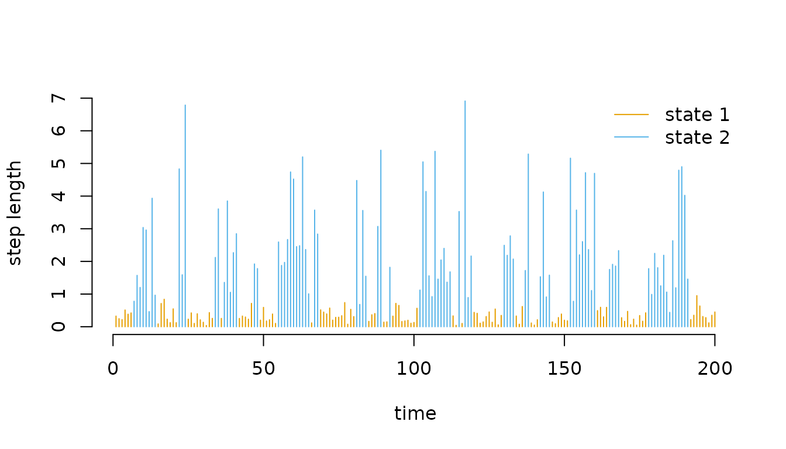
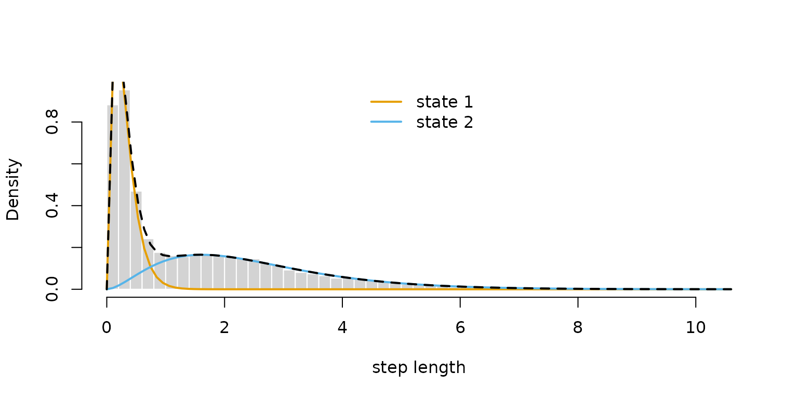
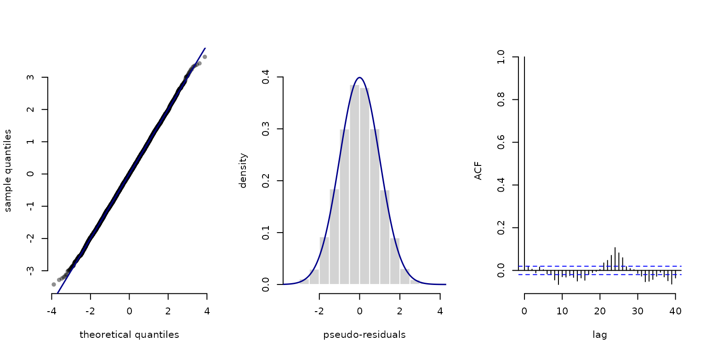

# 2 Automatic differentiation via RTMB

> Before diving into this vignette, we recommend reading the vignette
> [**Introduction to
> LaMa**](https://janolefi.github.io/LaMa/articles/Intro_to_LaMa.html).

Automatic differentiation (AD) is available in `R` through the `RTMB`
package. Using `RTMB`, you can define the likelihood for any statistical
model as plain `R` code and have access to fast and *exact* derivatives
of any order (without doing any calculations by hand!). This enables the
fitting of very complicated models, potentially with complex random
effect structures.

`LaMa` is fully compatible with AD provided by `RTMB`. Estimation of
latent Markov models with AD is much faster and more convenient, while
model specification is very smooth and less prone to errors. Let’s find
out how this works! We begin by loading the `LaMa` package, which
automatically loads `RTMB` as well.

``` r
library(LaMa)
#> Loading required package: RTMB
```

For the purpose of this vignette, we will analyse the `trex` data set
contained in the package. It contains hourly step lengths of a
Tyrannosaurus rex, living 66 million years ago, and we aim to understand
its behavioural process using HMMs.

``` r
head(trex, 5)
#>   tod      step     angle state
#> 1   9 0.3252437        NA     1
#> 2  10 0.2458265  2.234562     1
#> 3  11 0.2173252 -2.262418     1
#> 4  12 0.5114665 -2.958732     1
#> 5  13 0.3828494  1.811840     1
```

The workflow with `RTMB` is always very similar. We need to

1.  define the negative log-likelihood function,
2.  turn it into an AD objective function, and
3.  fit the model by numerical optimisation of the latter.

`RTMB` provides many functions that make the process of specifying a
likelihood function and calculating standard deviations of estimates
really simple.

We start by fitting a simple stationary HMM with state-dependent gamma
distributions for the step lengths. As a first step, we define the
initial parameter list `par` containing unconstrained (real-valued)
parameters and a `dat` list that contains the data and potential
hyperparameters – here N, the number of hidden states. The latter is not
strictly necessary but provides a neat way of wrapping everything needed
for the model fit.

``` r
par = list(
  log_mu = log(c(0.3, 1)),      # initial means for step length (log-transformed)
  log_sigma = log(c(0.2, 0.7)), # initial sds for step length (log-transformed)
  eta = rep(-2, 2)              # initial t.p.m. parameters (on logit scale)
  )    

dat = list(
  step = trex$step,   # hourly step lengths
  N = 2
  )
```

Because `par` is a named list, accessing the parameters inside the
likelihood is very convenient – annoying and error-prone indexing of
parameter vectors is gone! We define the negative log-likelihood
function in a similar fashion to basic numerical ML:

``` r
nll = function(par) {
  getAll(par, dat) # makes everything contained available without $
  Gamma = tpm(eta) # computes transition probability matrix from unconstrained eta
  delta = stationary(Gamma) # computes stationary distribution
  # Parameter transformations for strictly positive parameters
  mu = exp(log_mu)
  sigma = exp(log_sigma)
  # Reporting statements for later use
  REPORT(mu); ADREPORT(mu)
  REPORT(sigma); ADREPORT(sigma)
  # Calculating all state-dependent densities
  allprobs = matrix(1, nrow = length(step), ncol = N)
  ind = which(!is.na(step)) # only for non-NA obs.
  for(j in 1:N){
    allprobs[ind,j] = dgamma2(step[ind], mu[j], sigma[j])
  }
  -forward(delta, Gamma, allprobs) # simple forward algorithm
}
```

A few points should be made here:

- The likelihood is a function of the parameters to be estimated *only*
  while data and other parameters are not passed as an argument at this
  stage. This is something to get used to (I know), but just the way
  `RTMB` works.

- The [`getAll()`](https://rdrr.io/pkg/RTMB/man/TMB-interface.html)
  function is very useful. It unpacks both the `par` and the `dat` list,
  making all elements available without the `$` operator. At this stage,
  `nll` just takes the dat object from the global environment.

- Parameter transformations are still necessary: all parameters in `par`
  should be unconstrained and transformed to their natural scale inside
  the likelihood.

- The [`REPORT()`](https://rdrr.io/pkg/RTMB/man/TMB-interface.html)
  function offered by `RTMB` is really convenient. Any quantities
  calculated in the likelihood function (for which you have written the
  code anyway), if reported, will be available after optimisation, while
  the report statements are ignored during optimisation.

- For simple parameter transformations,
  [`ADREPORT()`](https://rdrr.io/pkg/RTMB/man/TMB-interface.html) is
  also great. It calculates standard deviations for
  [`ADREPORT()`](https://rdrr.io/pkg/RTMB/man/TMB-interface.html)ed
  quantities, based on the delta method. Just note that the delta method
  is not advisable for complex non-linear and multivariate
  transformations.

Having defined the negative log-likelihood, we can now create the
automatically differentiable objective function. This needs a little
explanation: At this point, `RTMB` takes `nll` and generates its own
(very fast) version of it, including a gradient. `MakeADFun()` now also
grabs whatever is saved as `dat` in the global environment and *bakes*
it into the objective function. Therefore, changes to `dat` after this
point will have no effect on the optimisation result. We set
`silent = TRUE` to suppress printing of the optimisation process.

``` r
obj = MakeADFun(nll, par, silent = TRUE) # creating the AD objective function
```

Let’s check out `obj`:

``` r
names(obj)
#>  [1] "par"          "fn"           "gr"           "he"           "hessian"     
#>  [6] "method"       "retape"       "env"          "report"       "simulate"    
#> [11] "force.update"
```

It contains the initial parameter `par` (now transformed to a named
vector), the objective function `fn` (which in this case just evaluates
`nll` but faster), its gradient `gr` and Hessian `he`. If we call these
functions without any argument, we get the corresponding values at the
initial parameter vector.

``` r
obj$par
#>     log_mu     log_mu  log_sigma  log_sigma        eta        eta 
#> -1.2039728  0.0000000 -1.6094379 -0.3566749 -2.0000000 -2.0000000
obj$fn()
#> [1] 16378.66
obj$gr()
#>          [,1]     [,2]    [,3]      [,4]     [,5]      [,6]
#> [1,] 609.4426 -2272.55 94.1283 -12144.32 151.3179 -181.5449
```

We are now ready to fit the model by optimising the objective function.
The routine [`nlminb()`](https://rdrr.io/r/stats/nlminb.html) is very
robust and allows us to provide a gradient function. While we also have
access to the Hessian function, we do not supply it to
[`nlminb()`](https://rdrr.io/r/stats/nlminb.html) because optimisation
is much faster if we use a quasi-Newton algorithm that approximates the
current Hessian based on previous gradient evaluations, compared to
using full Newton-Raphson.

``` r
opt = nlminb(obj$par, obj$fn, obj$gr) # minimisation
```

We can check out the estimated parameter and function value by

``` r
opt$par
#>     log_mu     log_mu  log_sigma  log_sigma        eta        eta 
#> -1.1923951  0.9185717 -1.6018327  0.3993241 -1.6519372 -1.5641927
opt$objective
#> [1] 10847.12
```

Note that the names `par` and `objective` are determined by
[`nlminb()`](https://rdrr.io/r/stats/nlminb.html). If you use a
different optimiser, these may be called differently.

However, `RTMB` provides a nicer way to get the estimates. `obj` is
automatically updated after the optimisation. Note that calling
`obj$gr()` after optimisation now gives the gradient at the optimum,
while `obj$par` is not updated but still the initial parameter vector
(kind of confusing). To get our estimated parameters on their natural
scale, we don’t have to do the backtransformation manually. We can just
run the reporting:

``` r
mod = report(obj) # runs the reporting from the negative log-likelihood once
(delta = mod$delta) # stationary distribution
#>        S1        S2 
#> 0.4817329 0.5182671
(Gamma = mod$Gamma) # estimated tpm
#>           S1        S2
#> S1 0.8269542 0.1730458
#> S2 0.1608473 0.8391527
(mu = mod$mu) # estimated state-dependent means
#> [1] 0.3034935 2.5057090
(sigma = mod$sigma) # estimated state-dependent sds
#> [1] 0.2015268 1.4908167
```

This works because of the
[`REPORT()`](https://rdrr.io/pkg/RTMB/man/TMB-interface.html) statements
in the likelihood function. Note that `delta`, `Gamma` and `allprobs`
are always reported by default when using
[`forward()`](https://janolefi.github.io/LaMa/reference/forward.md)
which is very useful for downstream tasks like state decoding or
residuals calculation. The `viterbi` and `stateprobs` functions either
take these as arguments or, more conveniently, can also take the whole
reported `mod` object as an input. Because the state-dependent
parameters depend on the specific model formulation, these need to be
reported manually by the user specifying the likelihood. Having all the
parameters, we can plot the decoded time series

``` r
# manually
mod$states = viterbi(mod$delta, mod$Gamma, mod$allprobs)

# or much simpler
mod$states = viterbi(mod = mod)

# defining color vector
color = c("orange", "deepskyblue")

plot(trex$step[1:200], type = "h", xlab = "time", ylab = "step length", 
     col = color[mod$states[1:200]], bty = "n")
legend("topright", col = color, lwd = 1, legend = c("state 1", "state 2"), bty = "n")
```



or the estimated state-dependent distributions.

``` r
hist(trex$step, prob = TRUE, breaks = 40, 
     bor = "white", main = "", xlab = "step length")
for(j in 1:2) curve(delta[j] * dgamma2(x, mu[j], sigma[j]), 
                    lwd = 2, add = T, col = color[j])
curve(delta[1]*dgamma2(x, mu[1], sigma[1]) + delta[2]*dgamma2(x, mu[2], sigma[2]), 
      lwd = 2, lty = 2, add = T)
legend("top", lwd = 2, col = color, legend = c("state 1", "state 2"), bty = "n")
```



We can also use the `sdreport()` function to directly give us standard
errors for our unconstrained parameters and everything we
[`ADREPORT()`](https://rdrr.io/pkg/RTMB/man/TMB-interface.html)ed. 

``` r
sdr = sdreport(obj)
```

We can then get an overview of the estimated parameters and
[`ADREPORT()`](https://rdrr.io/pkg/RTMB/man/TMB-interface.html)ed
quantities as well as their standard errors by

``` r
summary(sdr) # see ?summary.sdreport for more info
#>             Estimate  Std. Error
#> log_mu    -1.1923951 0.011461828
#> log_mu     0.9185717 0.009076411
#> log_sigma -1.6018327 0.016858309
#> log_sigma  0.3993241 0.013479572
#> eta       -1.6519372 0.042684391
#> eta       -1.5641927 0.041157505
#> mu         0.3034935 0.003478590
#> mu         2.5057090 0.022742845
#> sigma      0.2015268 0.003397402
#> sigma      1.4908167 0.020095571
```

To get the estimated parameters or their standard errors in list format,
type

``` r
# estimated parameter in list format
as.list(sdr, "Estimate")
# standard errors in list format
as.list(sdr, "Std")
```

and to get the estimates and standard errors for
[`ADREPORT()`](https://rdrr.io/pkg/RTMB/man/TMB-interface.html)ed
quantities in list format, type

``` r
# adreported parameters as list
as.list(sdr, "Estimate", report = TRUE)
# their standard errors
as.list(sdr, "Std", report = TRUE)
```

Lastly, the automatic reporting with `LaMa` and `RTMB` together makes
calculating pseudo-residuals really convenient:

``` r
pres_step = pseudo_res(obs = trex$step, # observation sequence
                       dist = "gamma2", # which parametric CDF to use
                       par = list(mean = mu, sd = sigma), # estimated pars for that CDF
                       mod = mod) # model object
plot(pres_step, hist = TRUE)
```



## Tips and common issues

There are some commonly occuring issues with `RTMB` to keep in mind. I
list the main ones I have encountered here – please let me know if you
encounter more so they can be added.

#### Non-standard distributions

If you need a non-standard probability distribution, existing
implementations will likely fail due to AD incompatibility. Check
whether the distribution is available in
[`RTMBdist`](https://janolefi.github.io/RTMBdist/), which provides a
library of AD-compatible distributions for use inside likelihood
functions.

#### Operator overloading

A typical issue is that some operators may need to be overloaded to
allow for automatic differentiation. In typical model setups `LaMa`
functions handle this automatically, but if you take a more
individualistic route and encounter an error like

``` r
stop("Invalid argument to 'advector' (lost class attribute?)")
```

you might have to overload the operator yourself. To do this put

``` r
"[<-" <- ADoverload("[<-")
```

as the first line of your likelihood function. If the error still
prevails also add

``` r
"c" <- ADoverload("c")
"diag<-" <- ADoverload("diag<-")
```

which should hopefully fix the error.

#### Initialising with `NA`

A common problem occurs when initialising objects with `NA` values and
then filling them with `numeric` values. `NA` is logical, which causes
type mismatches that break automatic differentiation. Always initialise
with `numeric` or `NaN` values instead. For example, avoid

``` r
X = array(dim = c(1,2,3))
# which is the same as
X = array(NA, dim = c(1,2,3))
```

and use

``` r
X = array(NaN, dim = c(1,2,3))
# or
X = array(0, dim = c(1,2,3))
```

#### Wrapping arrays in `AD()`

If you create an array and fill it with something parameter-dependent,
wrap it in [`AD()`](https://rdrr.io/pkg/RTMB/man/AD.html):

``` r
X <- AD(array(...))
```

This ensures `X` is an AD object from the start and that classes are
compatible. Wrapping in [`AD()`](https://rdrr.io/pkg/RTMB/man/AD.html)
is generally a good idea to resolve the above error, as it introduces no
meaningful overhead when not needed.

#### No `if` statements on parameters

You cannot use `if` statements **on parameters directly**, as these are
not differentiable. `RTMB` builds the *tape* (computational graph) at
the initial parameter value, so `if` branches depending on a parameter
will produce gradients that are wrong elsewhere. `RTMB` will fail,
likely without a helpful error message. `if` statements that do not
involve parameters are typically fine, since the branch is fixed
throughout optimisation.

#### Byte compiler side effects

Some unfortunate side effects of `R`’s byte compiler (enabled by
default) can interfere with `RTMB`. If you encounter an error not
covered above, try disabling it with

``` r
compiler::enableJIT(0)
#> [1] 3
```

#### Further reading

For more information on `RTMB`, see its
[documentation](https://CRAN.R-project.org/package=RTMB) or the [TMB
users Google group](https://groups.google.com/g/tmb-users).

> Continue reading with [**Penalised
> splines**](https://janolefi.github.io/LaMa/articles/Penalised_splines.html).
