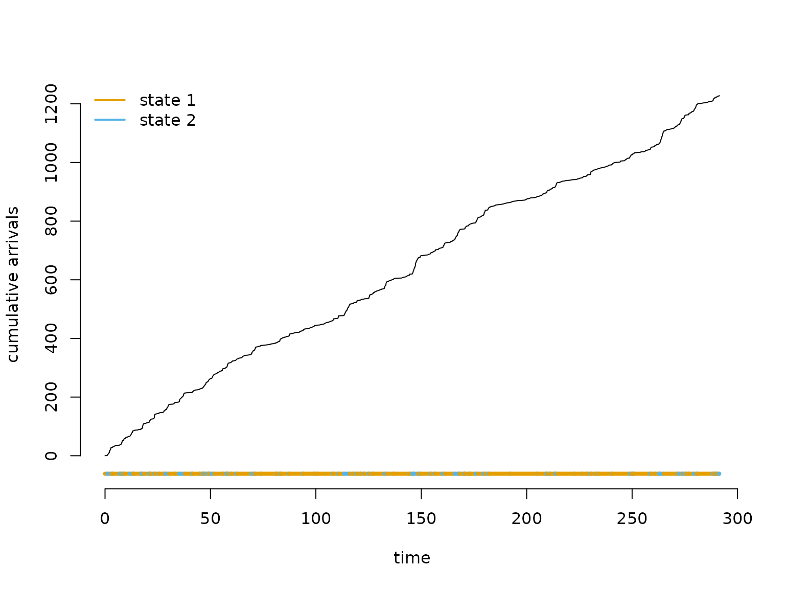
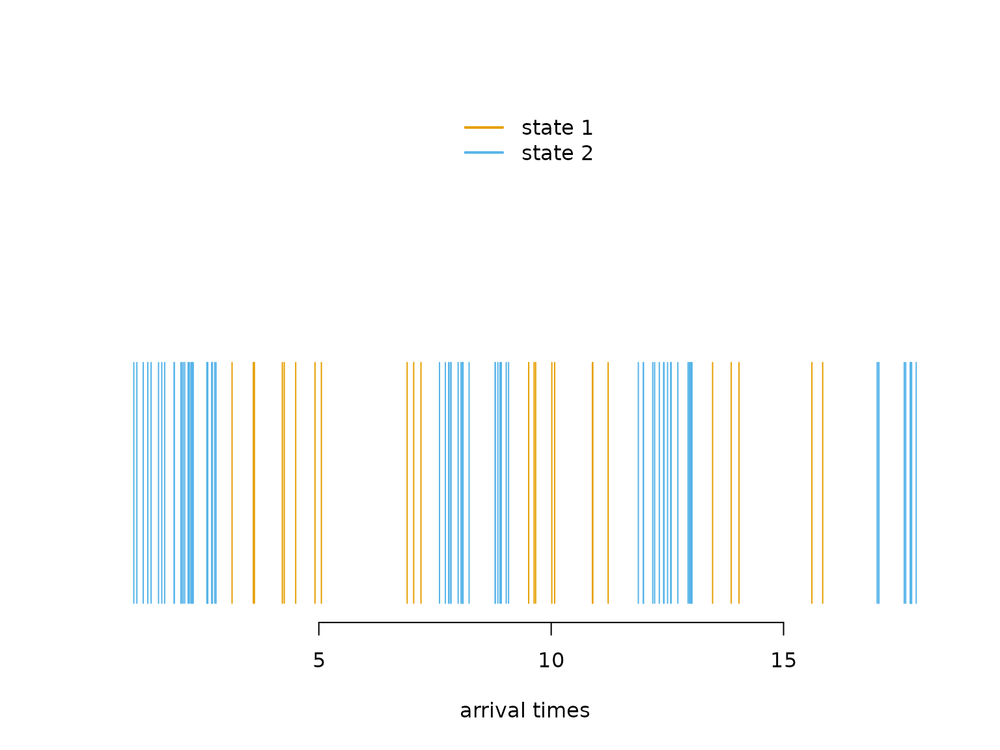
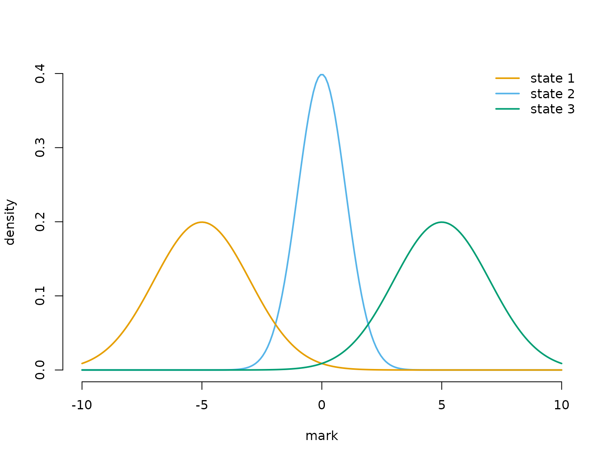
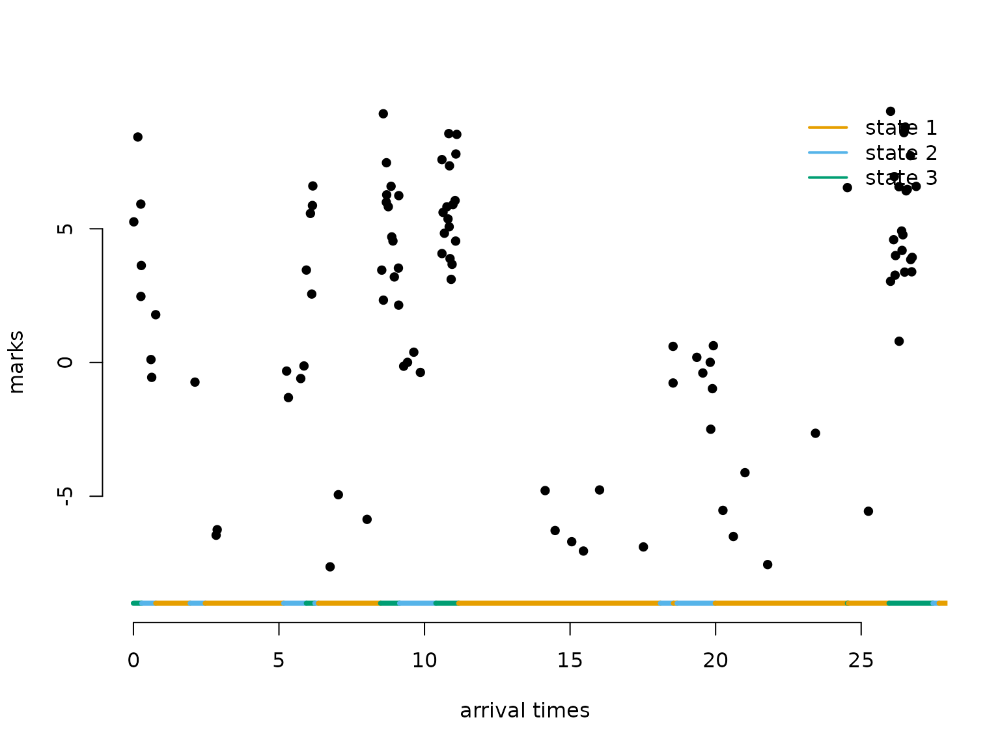
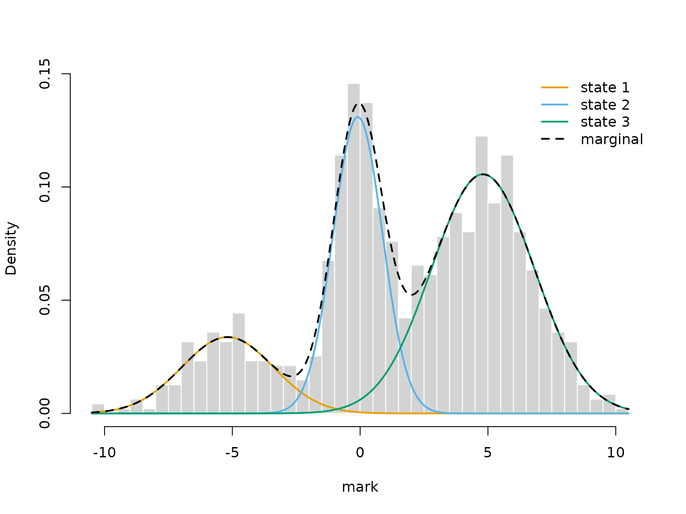
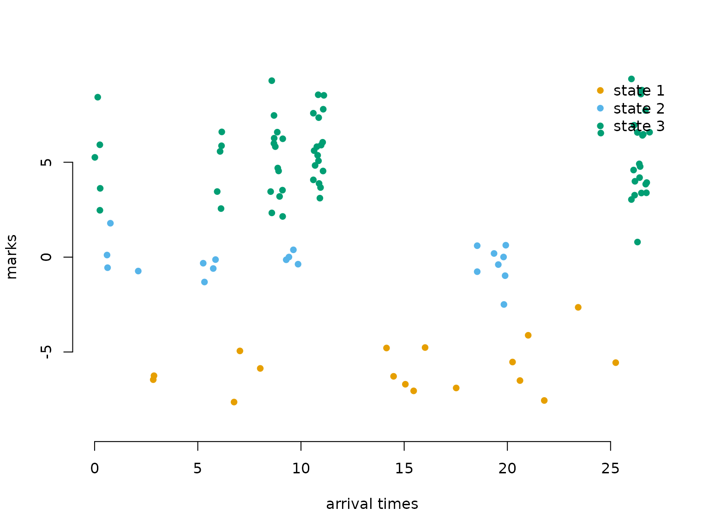

# 7 Markov-modulated (marked) Poisson processes

> Before diving into this vignette, we recommend reading the vignettes
> [**Introduction to
> LaMa**](https://janolefi.github.io/LaMa/articles/Intro_to_LaMa.html),
> [**Automatic differentiation via
> RTMB**](https://janolefi.github.io/LaMa/articles/LaMa_and_RTMB.html),
> and [**Continuous-time
> HMMs**](https://janolefi.github.io/LaMa/articles/Continuous_time_HMMs.html).

``` r

library(LaMa)
#> Loading required package: RTMB
```

In a continuous-time HMM, observation *values* carry information about
the latent state while the observation *times* are treated as fixed or
uninformative (the snapshot property). The **Markov-modulated Poisson
process (MMPP)** reverses this: the **arrival times themselves are the
observations**, and their spacing carries information about the hidden
state process.

The key idea is that an unobserved continuous-time Markov chain (CTMC)
modulates the rate of a Poisson process. While the chain stays in state
j, events arrive at a constant, state-specific rate \lambda_j. A
high-rate state produces rapid bursts of closely spaced arrivals; a
low-rate state produces sparse events. By fitting the model to the
observed arrival times alone, we can infer both the Poisson rates and
the dynamics of the hidden CTMC (described by its generator matrix Q, as
in the continuous-time HMM vignette).

A natural extension, the **Markov-modulated marked Poisson process
(MMMPP)**, additionally associates a random **mark** y_i with each
arrival. Marks are drawn from a state-dependent distribution at the
moment of arrival, providing a second source of information about the
latent state alongside the timing. For more background see
Meier-Hellstern ([1987](#ref-meier1987fitting)) and Langrock et al.
([2013](#ref-langrock2013markov)).

## Likelihood

### MMPP

For n arrivals at times t_1 \< \dots \< t_n, let \Delta t_i = t\_{i+1} -
t_i be the inter-arrival waiting times and \Lambda =
\text{diag}(\lambda_1, \dots, \lambda_N) the diagonal matrix of
state-dependent rates. The likelihood of a stationary MMPP is

L(\theta) = \pi \Bigl(\prod\_{i=1}^{n-1} \exp\bigl((Q - \Lambda)\\\Delta
t_i\bigr)\\\Lambda\Bigr)\\\mathbf{1}^\top,

where \pi is the stationary distribution of the CTMC and \mathbf{1} is a
column vector of ones. The matrix \exp((Q - \Lambda)\\\Delta t_i)
propagates the state distribution through gap \Delta t_i while
accounting for the fact that *no* event occurred during this interval;
\Lambda then contributes the instantaneous rate of the event that *does*
occur at the end of the gap.

This has **exactly the same structure** as the regular HMM likelihood,
so [`forward()`](https://janolefi.github.io/LaMa/reference/forward.md)
applies directly. We construct the `allprobs` matrix with n rows: the
first row is all ones (pure initialisation with \pi, no density
contribution), and rows 2, \dots, n all equal (\lambda_1, \dots,
\lambda_N) — the instantaneous arrival-rate density at each observed
event.

### MMMPP

When each arrival i also carries a mark y_i, the likelihood gains one
additional factor per event:

L(\theta) = \pi\\P(y_1) \Bigl(\prod\_{i=1}^{n-1} \exp\bigl((Q -
\Lambda)\\\Delta t_i\bigr)\\\Lambda\\P(y\_{i+1})\Bigr)\\\mathbf{1}^\top,

where P(y_i) is a diagonal matrix of state-dependent densities evaluated
at mark y_i. In practice we fold \Lambda into the `allprobs` matrix:
after filling in the mark densities for all n rows, rows 2, \dots, n are
multiplied element-wise by (\lambda_1, \dots, \lambda_N), so the same
[`forward()`](https://janolefi.github.io/LaMa/reference/forward.md) call
handles everything.

## Example 1: Markov-modulated Poisson processes

### Setting parameters

We use a 2-state model. State 2 has a much higher arrival rate and
shorter mean sojourn time — it is the **bursty** state.

``` r

lambda = c(2, 15)  # state-dependent Poisson rates
Q = matrix(c(-0.5, 0.5,
              2.0, -2.0), nrow = 2, byrow = TRUE)
```

The mean sojourn time in state 1 is 1/0.5 = 2 time units; in state 2 it
is 1/2 = 0.5 time units.

### Simulating an MMPP

The simulation mirrors the CTMC simulation from the continuous-time HMM
vignette. The only difference is that instead of drawing observation
values during each sojourn, we draw Poisson arrival times. Within each
sojourn of length `dwell`, the number of arrivals is Poisson with mean
`lambda * dwell`, and their positions are uniform over the sojourn
interval.

``` r

set.seed(123)

k = 200              # number of state switches to simulate
s = rep(NA, k)       # latent state sequence
trans_times = rep(NA, k)  # cumulative transition times

# initialise
s[1] = sample(1:2, 1)
dwell = rexp(1, -Q[s[1], s[1]])
trans_times[1] = dwell

n_arrivals = rpois(1, lambda[s[1]] * dwell)
arrival_times = sort(runif(n_arrivals, 0, dwell))

for (t in 2:k) {
  # 2-state chain: always switches to the other state
  s[t] = 3 - s[t-1]

  dwell = rexp(1, -Q[s[t], s[t]])
  trans_times[t] = trans_times[t-1] + dwell

  t_start = trans_times[t-1]
  t_end   = trans_times[t]

  # Poisson arrivals uniformly distributed within sojourn
  n_arrivals = rpois(1, lambda[s[t]] * dwell)
  arrival_times = c(arrival_times, sort(runif(n_arrivals, t_start, t_end)))
}
```

The **cumulative arrivals plot** is the clearest way to see how the
Poisson rate changes with the hidden state: the slope of the curve
equals the current arrival rate, so steep segments correspond to the
bursty state and shallow segments to the slow state.

``` r

color = LaMaColors(2)
n = length(arrival_times)
plot(c(0, arrival_times), 0:n, type = "l", bty = "n",
     xlab = "time", ylab = "cumulative arrivals",
     ylim = c(-n * 0.05, n))
segments(x0 = c(0, trans_times[-k]), x1 = trans_times,
         y0 = rep(-n * 0.05, k), y1 = rep(-n * 0.05, k),
         col = color[s], lwd = 4)
legend("topleft", lwd = 2, col = color, legend = paste("state", 1:2), box.lwd = 0)
```



### Writing the negative log-likelihood function

The `allprobs` matrix has `length(timediff) + 1` rows (one per arrival,
plus one for initialisation). Row 1 is all ones; the remaining rows
carry the state-dependent rates \lambda_j. The transition matrices are
computed via `tpm_ct(Q, timediff, lambda)`, where the optional `lambda`
argument internally subtracts \Lambda from Q before the matrix
exponential — simultaneously propagating the state distribution and
accounting for the absence of arrivals during each gap.

``` r

nll = function(par) {
  getAll(par, dat)
  lambda = exp(log_lambda); REPORT(lambda)
  Q = generator(log_qs); REPORT(Q)
  Pi = stationary_ct(Q); REPORT(Pi)
  Qube = tpm_ct(Q, timediff, lambda)
  allprobs = matrix(rep(lambda, length(timediff) + 1),
                    nrow = length(timediff) + 1, ncol = N, byrow = TRUE)
  allprobs[1,] = 1
  -forward(Pi, Qube, allprobs)
}
```

### Fitting the model

``` r

N = 2
timediff = diff(arrival_times)

par = list(
  log_lambda = log(c(2, 15)),
  log_qs     = log(c(2, 0.5))
)
dat = list(
  timediff = timediff,
  N = N
)

obj = MakeADFun(nll, par, silent = TRUE)
system.time(
  opt <- nlminb(obj$par, obj$fn, obj$gr)
)
#>    user  system elapsed 
#>   0.333   0.000   0.333
mod = report(obj)
```

### Results

``` r

mod$lambda           # true: 2, 15
#> [1]  1.950361 15.056559
round(mod$Q, 3)      # true: Q as defined above
#>        S1     S2
#> S1 -0.399  0.399
#> S2  1.883 -1.883
round(1 / diag(-mod$Q), 2)  # mean dwell times; true: 2, 0.5
#>   S1   S2 
#> 2.51 0.53
mod$Pi               # stationary distribution of the CTMC
#>        S1        S2 
#> 0.8251464 0.1748536
```

We can decode the most probable state sequence with
[`viterbi()`](https://janolefi.github.io/LaMa/reference/viterbi.md) and
colour each arrival by its inferred state.

``` r

states = viterbi(mod = mod)

plot(arrival_times[1:100], rep(0.5, 100), type = "h", bty = "n",
     ylim = c(0, 1), yaxt = "n", col = color[states[1:100]],
     xlab = "arrival times", ylab = "")
legend("top", lwd = 2, col = color, legend = paste("state", 1:N), box.lwd = 0)
```



## Example 2: Markov-modulated marked Poisson processes

Adding **marks** to each arrival provides a second channel of
information about the latent state. Here we use three states with
well-separated mark distributions so the model is clearly identifiable.

### Setting parameters

``` r

lambda = c(1, 5, 20)
Q = matrix(c(-0.5, 0.3, 0.2,
              0.7, -1.0, 0.3,
              1.0,  1.0, -2.0), nrow = 3, byrow = TRUE)
mu    = c(-5, 0, 5)
sigma = c(2, 1, 2)

color = LaMaColors(3)
curve(dnorm(x, mu[2], sigma[2]), xlim = c(-10, 10), bty = "n",
      lwd = 2, col = color[2], n = 200, ylab = "density", xlab = "mark")
curve(dnorm(x, mu[1], sigma[1]), add = TRUE, lwd = 2, col = color[1], n = 200)
curve(dnorm(x, mu[3], sigma[3]), add = TRUE, lwd = 2, col = color[3], n = 200)
legend("topright", lwd = 2, col = color, bty = "n", legend = paste("state", 1:3))
```



### Simulating an MMMPP

For three states, the conditional next-state probabilities after leaving
state i are \omega\_{ij} = q\_{ij}/(-q\_{ii}). Marks are drawn
independently from the state-dependent distribution at each arrival, in
the same order as the arrival times.

``` r

set.seed(123)

k = 200
s = rep(NA, k)
trans_times = rep(NA, k)

s[1] = sample(1:3, 1)
dwell = rexp(1, -Q[s[1], s[1]])
trans_times[1] = dwell

n_arrivals = rpois(1, lambda[s[1]] * dwell)
new_arrivals = sort(runif(n_arrivals, 0, dwell))
arrival_times = new_arrivals
marks = rnorm(n_arrivals, mu[s[1]], sigma[s[1]])

for (t in 2:k) {
  # conditional next-state probabilities: omega_ij = q_ij / (-q_ii)
  omega = Q[s[t-1], -s[t-1]] / -Q[s[t-1], s[t-1]]
  s[t] = sample((1:3)[-s[t-1]], 1, prob = omega)

  dwell = rexp(1, -Q[s[t], s[t]])
  trans_times[t] = trans_times[t-1] + dwell

  t_start = trans_times[t-1]
  t_end   = trans_times[t]

  n_arrivals = rpois(1, lambda[s[t]] * dwell)
  new_arrivals = sort(runif(n_arrivals, t_start, t_end))
  arrival_times = c(arrival_times, new_arrivals)
  marks = c(marks, rnorm(n_arrivals, mu[s[t]], sigma[s[t]]))
}
```

``` r

n = length(arrival_times)
plot(arrival_times[1:100], marks[1:100], pch = 16, bty = "n",
     ylim = c(-9, 9), xlab = "arrival times", ylab = "marks")
segments(x0 = c(0, trans_times[1:98]), x1 = trans_times[1:99],
         y0 = rep(-9, 99), y1 = rep(-9, 99), col = color[s[1:99]], lwd = 4)
legend("topright", lwd = 2, col = color,
       legend = paste("state", 1:3), box.lwd = 0)
```



### Writing the negative log-likelihood function

The `allprobs` matrix is built from the mark densities for all n
arrivals. Rows 2, \dots, n are then multiplied element-wise by the
state-dependent rates (\lambda_1, \dots, \lambda_N) to fold in the
Poisson arrival contribution, giving the combined MMMPP likelihood.

``` r

nll2 = function(par) {
  getAll(par, dat)
  lambda = exp(log_lambda); REPORT(lambda)
  REPORT(mu)
  sigma = exp(log_sigma); REPORT(sigma)
  Q = generator(log_qs); REPORT(Q)
  Pi = stationary_ct(Q); REPORT(Pi)
  Qube = tpm_ct(Q, timediff, lambda)
  allprobs = matrix(1, length(marks), N)
  for (j in 1:N) allprobs[, j] = dnorm(marks, mu[j], sigma[j])
  # multiply rows 2:n by lambda to fold in the arrival-rate contribution
  allprobs[-1,] = allprobs[-1,] * matrix(lambda, length(marks) - 1, N, byrow = TRUE)
  -forward(Pi, Qube, allprobs)
}
```

### Fitting the model

``` r

N = 3
timediff = diff(arrival_times)

par = list(
  log_lambda = log(c(1, 5, 20)),
  mu         = c(-5, 0, 5),
  log_sigma  = log(c(2, 1, 2)),
  log_qs     = log(c(0.7, 1, 0.3, 1, 0.2, 0.3))
)
dat = list(
  marks    = marks,
  timediff = timediff,
  N = N
)

obj2 = MakeADFun(nll2, par, silent = TRUE)
system.time(
  opt2 <- nlminb(obj2$par, obj2$fn, obj2$gr)
)
#>    user  system elapsed 
#>   0.988   0.000   0.987
mod2 = report(obj2)
```

### Results

``` r

mod2$lambda                  # true: 1, 5, 20
#> [1]  0.9646738  4.8641071 19.5009530
mod2$mu                      # true: -5, 0, 5
#> [1] -5.18540494 -0.09096836  4.80540113
mod2$sigma                   # true: 2, 1, 2
#> [1] 1.7931070 0.9644496 2.0093249
round(mod2$Q, 3)             # true: Q as defined above
#>        S1     S2     S3
#> S1 -0.591  0.279  0.312
#> S2  0.926 -1.180  0.254
#> S3  1.193  1.210 -2.403
round(1 / diag(-mod2$Q), 2) # mean dwell times; true: 2, 1, 0.5
#>   S1   S2   S3 
#> 1.69 0.85 0.42
mod2$Pi                      # stationary distribution
#>        S1        S2        S3 
#> 0.6297018 0.2609501 0.1093482
```

Overlaying the fitted state-dependent densities on a histogram of all
marks provides an intuitive model check. Note that the mixture weights
are **not** the stationary distribution \pi_j (proportion of *time* in
state j) but the rate-weighted proportions w_j \propto \pi_j \lambda_j —
states with higher arrival rates contribute disproportionately more
marks.

``` r

# marks arrive at rate lambda_j in state j, so the fraction of marks from
# state j is proportional to Pi[j] * lambda[j], not Pi[j] alone
w = mod2$Pi * mod2$lambda / sum(mod2$Pi * mod2$lambda)

hist(marks, prob = TRUE, breaks = 50, border = "white", main = "",
     xlab = "mark")
for (j in 1:N) {
  curve(w[j] * dnorm(x, mod2$mu[j], mod2$sigma[j]),
        add = TRUE, lwd = 2, col = color[j], n = 300)
}
curve(rowSums(sapply(1:N, function(j) w[j] * dnorm(x, mod2$mu[j], mod2$sigma[j]))),
      add = TRUE, lwd = 2, lty = 2, n = 300)
legend("topright", lwd = 2, lty = c(1, 1, 1, 2), bty = "n",
       col = c(color, "black"), legend = c(paste("state", 1:N), "marginal"))
```



State decoding via
[`viterbi()`](https://janolefi.github.io/LaMa/reference/viterbi.md) now
colours each mark by its inferred state — combining both timing and mark
information to assign the latent state.

``` r

states2 = viterbi(mod = mod2)

plot(arrival_times[1:100], marks[1:100], pch = 16, bty = "n",
     col = color[states2[1:100]],
     ylim = c(-9, 9), xlab = "arrival times", ylab = "marks")
legend("topright", pch = 16, col = color,
       legend = paste("state", 1:3), box.lwd = 0)
```



## References

Langrock, Roland, David L Borchers, and Hans J Skaug. 2013.
“Markov-Modulated Nonhomogeneous Poisson Processes for Modeling
Detections in Surveys of Marine Mammal Abundance.” *Journal of the
American Statistical Association* 108 (503): 840–51.

Meier-Hellstern, Kathleen S. 1987. “A Fitting Algorithm for
Markov-Modulated Poisson Processes Having Two Arrival Rates.” *European
Journal of Operational Research* 29 (3): 370–77.
