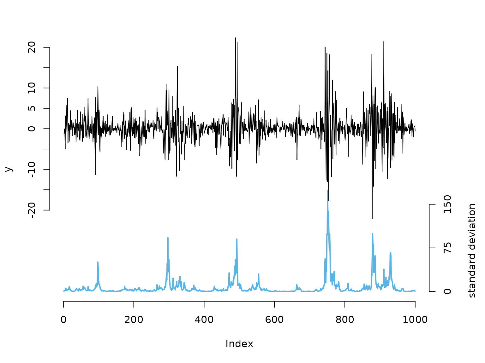
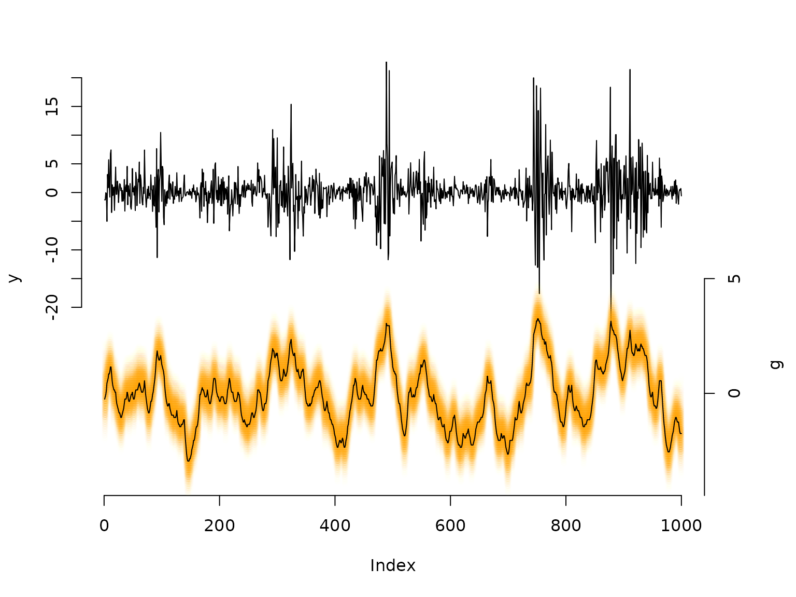

# 8 State-space models

> Before diving into this vignette, we recommend reading the vignettes
> [**Introduction to
> LaMa**](https://janolefi.github.io/LaMa/articles/Intro_to_LaMa.html)
> and [**Automatic differentiation via
> RTMB**](https://janolefi.github.io/LaMa/articles/LaMa_and_RTMB.html).

``` r

library(LaMa)
#> Loading required package: RTMB
```

This vignette shows how to fit state-space models which can be
interpreted as generalisation of HMMs to continuous state spaces.
Several approaches exist to fitting such models, but Langrock
([2011](#ref-langrock2011some)) showed that very **general state-space
models** can be fitted via approximate maximum likelihood estimation,
when the continuous state space is **finely discretised**. This is
equivalent to numerical integration over the state process using
midpoint quadrature.

Here, we will showcase this approach for a basic **stochastic volatility
model** which, while being very simple, captures most of the stylised
facts of financial time series. In this model the unobserved marked
volatility is described by an AR(1) process:

g_t = \phi g\_{t-1} + \sigma \eta_t, \qquad \eta_t \sim N(0,1), with
autoregression parameter \phi \< 1 and dispersion parameter \sigma.
Share returns y_t can then be modelled as y_t = \beta \epsilon_t
\exp(g_t / 2), where \epsilon_t \sim N(0,1) and \beta \> 0 is the
baseline standard deviation of the returns (when g_t is in equilibrium),
which implies y_t \mid g_t \sim N(0, (\beta e^{g_t / 2})^2).

## Example: stochastic volatility model

### Simulating data

We start by simulating data from the above specified model:

``` r

beta = 2 # baseline standard deviation
phi = 0.95 # AR parameter of the log-volatility process
sigma = 0.5 # variability of the log-volatility process

n = 1000
set.seed(123)
g = rep(NA, n)
g[1] = rnorm(1, 0, sigma / sqrt(1-phi^2)) # stationary distribution of AR(1) process
for(t in 2:n){
  # sampling next state based on previous state and AR(1) equation
  g[t] = rnorm(1, phi*g[t-1], sigma)
}
# sampling zero-mean observations with standard deviation given by latent process
y = rnorm(n, 0, beta * exp(g/2)) 

# share returns
color = LaMaColors(2)
oldpar = par(mar = c(5,4,3,4.5)+0.1)
plot(y, type = "l", bty = "n", ylim = c(-40,20), yaxt = "n")
# true underlying standard deviation
lines(beta*exp(g)/7 - 40, col = color[2], lwd = 2)
axis(side=2, at = seq(-20,20,by=5), labels = seq(-20,20,by=5))
axis(side=4, at = seq(0,150,by=75)/7-40, labels = seq(0,150,by=75))
mtext("standard deviation", side=4, line=3, at = -30)
```



``` r

par(oldpar)
```

### Writing the negative log-likelihood function

To calculate the likelihood, we need to integrate over the state space.
We approximate this high-dimensional integral using a midpoint
quadrature which ultimately results in a fine discretisation of the
continuous state space into the intervals `b` with width `h` and
midpoints `bstar` ([Langrock 2011](#ref-langrock2011some)). Thus, the
likelihood below corresponds to a basic HMM likelihood with a large
number of states.

``` r

nll = function(par) {
  getAll(par, dat)
  phi   = plogis(logit_phi); REPORT(phi)
  sigma = exp(log_sigma);    REPORT(sigma)
  beta  = exp(log_beta);     REPORT(beta)
  b     = seq(-bm, bm, length = m + 1) # intervals for midpoint quadrature
  h     = b[2] - b[1]                  # interval width
  bstar = (b[-1] + b[-(m+1)]) / 2     # interval midpoints
  # approximating t.p.m. via midpoint quadrature
  Gamma = sapply(bstar, dnorm, mean = phi * bstar, sd = sigma) * h
  # stationary distribution of the AR(1) process: g ~ N(0, sigma^2/(1-phi^2))
  delta = h * dnorm(bstar, 0, sigma / sqrt(1 - phi^2))
  # state-dependent densities: y_t | g_t ~ N(0, (beta * exp(g_t/2))^2)
  allprobs = t(sapply(y, dnorm, mean = 0, sd = beta * exp(bstar / 2)))
  -forward(delta, Gamma, allprobs)
}
```

### Fitting an SSM to the data

Because the transition matrix \Gamma is 100 \times 100 and dense, we set
`TapeConfig(matmul = "atomic")` before building the AD objective.

By default (`"plain"`), `RTMB` unwraps every matrix multiplication into
all its individual scalar operations on the tape. This is efficient when
matrices are sparse, since the tape can exploit the structure. For
large, dense matrices it produces an enormous tape — one scalar entry
per element of the result — which slows both tape construction and
subsequent gradient evaluation.

Declaring matrix multiplications as **atomic** treats each one as a
single operation on the tape, keeping it compact regardless of matrix
size. If your transition matrix were sparse — for example in models with
local state dependence — the default `"plain"` setting would be
preferable.

``` r

TapeConfig(matmul = "atomic")

bm = 5   # truncation of state space at ±bm
m  = 100 # number of quadrature points

par = list(
  logit_phi = qlogis(0.95),
  log_sigma = log(0.3),
  log_beta  = log(1)
)
dat = list(y = y, bm = bm, m = m)

obj = MakeADFun(nll, par, silent = TRUE)
system.time(
  opt <- nlminb(obj$par, obj$fn, obj$gr)
)
#>    user  system elapsed 
#>   0.642   0.000   0.642
mod = report(obj)
```

### Results

``` r

mod$phi    # true: 0.95
#> [1] 0.951655
mod$sigma  # true: 0.5
#> [1] 0.4436881
mod$beta   # true: 2
#> [1] 2.18407

## decoding states
b     = seq(-bm, bm, length = m + 1)
h     = b[2] - b[1]
bstar = (b[-1] + b[-(m+1)]) / 2
Gamma    = sapply(bstar, dnorm, mean = mod$phi * bstar, sd = mod$sigma) * h
delta    = h * dnorm(bstar, 0, mod$sigma / sqrt(1 - mod$phi^2))
allprobs = t(sapply(y, dnorm, mean = 0, sd = mod$beta * exp(bstar / 2)))

probs  = stateprobs(delta, Gamma, allprobs) # local/soft decoding
states = viterbi(delta, Gamma, allprobs)    # global/hard decoding

oldpar = par(mar = c(5,4,3,4.5)+0.1)
plot(y, type = "l", bty = "n", ylim = c(-50,20), yaxt = "n")
# with many states, plotting the full conditional distribution is more informative
# than just the single most-probable state
maxprobs = apply(probs, 1, max)
for(t in 1:nrow(probs)){
  colend = round((probs[t,] / (maxprobs[t] * 5)) * 100)
  colend[which(colend < 10)] = paste0("0", colend[which(colend < 10)])
  points(rep(t, m), bstar * 4 - 35, col = paste0("#FFA200", colend), pch = 20)
}
# Viterbi-decoded path as a summary line
lines(bstar[states] * 4 - 35)

axis(side = 2, at = seq(-20, 20, by = 5), labels = seq(-20, 20, by = 5))
axis(side = 4, at = seq(-5, 5, by = 5) * 4 - 35, labels = seq(-5, 5, by = 5))
mtext("g", side = 4, line = 3, at = -30)
```



``` r

par(oldpar)
```

## Comparison to Laplace approximation

An alternative way to marginalise over the continuous state process is
the **Laplace approximation**, available in `RTMB` via the `random`
argument of `MakeADFun()`. Instead of discretising the state space, we
write the **joint negative log-likelihood** — the negative log of the
joint density of observations and states — and declare the state
sequence g_1, \dots, g_T as random effects. `RTMB` then integrates them
out automatically using the Laplace approximation.

For the stochastic volatility model the joint negative log-likelihood is

-\ell(\theta,\\ g\_{1:T}) = -\log f(g_1) - \sum\_{t=2}^T \log f(g_t \mid
g\_{t-1}) - \sum\_{t=1}^T \log f(y_t \mid g_t),

where g_1 \sim N(0,\\ \sigma^2/(1-\phi^2)), g_t \mid g\_{t-1} \sim
N(\phi g\_{t-1},\\ \sigma^2), and y_t \mid g_t \sim N(0,\\ (\beta
e^{g_t/2})^2).

``` r

jnll = function(par) {
  getAll(par, dat)
  phi   = plogis(logit_phi); REPORT(phi)
  sigma = exp(log_sigma);    REPORT(sigma)
  beta  = exp(log_beta);     REPORT(beta)
  jnll = 0
  # stationary initial distribution: g_1 ~ N(0, sigma^2 / (1 - phi^2))
  jnll = jnll - dnorm(g[1], 0, sigma / sqrt(1 - phi^2), log = TRUE)
  # AR(1) state transitions: g_t | g_{t-1} ~ N(phi * g_{t-1}, sigma^2)
  jnll = jnll - sum(dnorm(g[-1], phi * g[-length(g)], sigma, log = TRUE))
  # observations: y_t | g_t ~ N(0, (beta * exp(g_t / 2))^2)
  jnll = jnll - sum(dnorm(y, 0, beta * exp(g / 2), log = TRUE))
  jnll
}
```

The state sequence `g` is included in the parameter list and declared as
`random` — `MakeADFun()` marginalises over it internally.

``` r

dat = list(y = y)

par_lap = list(
  logit_phi = qlogis(0.95),
  log_sigma  = log(0.3),
  log_beta   = log(1),
  g          = rep(0, n)   # random effects initialised at zero
)

obj_lap = MakeADFun(jnll, par_lap, random = "g", silent = TRUE)
system.time(
  opt_lap <- nlminb(obj_lap$par, obj_lap$fn, obj_lap$gr)
)
#>    user  system elapsed 
#>   0.183   0.005   0.189
mod_lap = report(obj_lap)
```

``` r

mod_lap$phi    # true: 0.95
#> [1] 0.9525517
mod_lap$sigma  # true: 0.5
#> [1] 0.4348222
mod_lap$beta   # true: 2
#> [1] 2.182106
```

The Laplace approach is typically **faster** because it avoids the
expensive m \times m matrix operations of the discretisation: for a
Markov state process the Hessian of the random-effect log-posterior is
tridiagonal, so each Laplace step costs O(T) rather than O(m^2 T).

Comparing the two sets of estimates, \hat{\phi} and \hat{\sigma} differ
slightly between the two approaches — only at the third decimal place
here, and with a single dataset we cannot distinguish approximation
error from ordinary sampling variation. In general, however, the Laplace
approximation is not exact: it is only exact when the random-effect
posterior is truly Gaussian given the fixed parameters, which is never
strictly the case because \phi and \sigma enter the likelihood in a
nonlinear way. Systematic discrepancies can grow substantially for
non-Gaussian state processes such as Markov-switching autoregressive
models, or for strongly non-Gaussian conditional distributions such as
Bernoulli observations, where the posterior over g is multimodal or
strongly skewed.

The discretisation approach makes no such assumption: increasing `m`
reduces the quadrature error at the cost of computation time, giving
full control over the approximation quality.

## References

Langrock, Roland. 2011. “On Some Special-Purpose Hidden Markov Models.”
PhD thesis, University of Göttingen.
